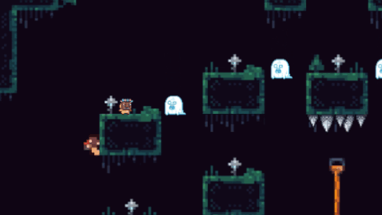

# 🗿 Tribe Explorer

  
   
  <b>A retro-style 2D platformer built from the ground up in C++.</b>

---

### 🕹️ Project Overview
**Tribe Explorer** is a recreation of a retro platformer, developed for the **Programming 2** course. The project focuses on implementing core game engine systems from scratch using C++, with a particular emphasis on precise collision detection and modular entity management.

### 🚀 Key Technical Features
* **SVG-Based Collisions:** Unlike standard bounding boxes, this project utilizes **SVG (Scalable Vector Graphics)** data to define collision boundaries. This allows for pixel-perfect environmental interaction and complex slope physics.
* **Animation System:** Implemented a sprite-based animation controller to handle state transitions (Idle, Run, Jump, Fall).
* **AI & Pathfinding:** Enemies feature automated patrolling with simple pathing logic and edge-detection to navigate the platforms.
* **Audio Engine:** Full sound implementation for environmental effects, character actions, and background music.

### 🛠️ The Tech Behind the Tribe
* **Language:** C++
* **Collision Logic:** Vector-based intersection tests using parsed SVG paths.
* **Physics:** Custom gravity and friction constants to replicate authentic "retro" platformer movement.

